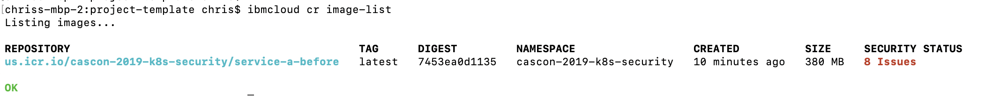
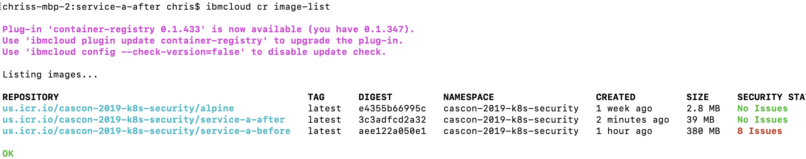
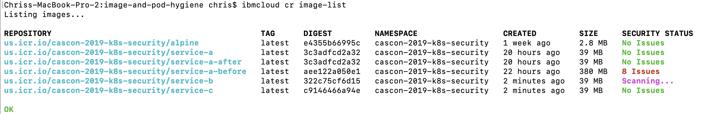

# Image and Pod Security
This scenario will deal with limiting the attack surface of containers via Dockerfile and Pod spec suggested practices.  You will learn how to force non-root execution of containers, as well as how IBM container registry can help with detercting image vulnerabilities. 

# Setup
1. You have configured your kubectl command line to point to a k8s cluster 
1. All commands below are run relative to this directory

# service-a-before

## Dockerfile
Note that the [Dockerfile for service-a](./service-a-before/Dockerfile) has the following issues:

1. Pulls from base Dockerhub latest node image
1. It uses the root user to execute code
1. It requires file storage and uses the host path option

## Pod
Note that the [pod](./service-a-before/Pod.yml) does not leverage any security context to force non-root user execution.

## Build and push image
1. cd ./service-a-before
1. docker build -t service-a-before:latest .
1. docker tag service-a-before:latest us.icr.io/cascon-2019-k8s-security/service-a-before:latest
1. ibmcloud cr login
1. docker push us.icr.io/cascon-2019-k8s-security/service-a-before:latest
1. ibmcloud cr image-list



As you can see, the image has security issues as is rather large.  Larger images can have a greater attack surface, so we should try to not only mitigate the security issues, but also reduce the image size.

## Deploy service

1. cd ..
1. kubectl create namespace org-1
1. kubectl get secret default-us-icr-io --export -o yaml | kubectl apply --namespace=org-1 -f -
2. Add image pull secret to default service account. kubectl edit sa default -n org-1
```
apiVersion: v1
kind: ServiceAccount
metadata:
  name: default
  namespace: org-1
secrets:
- name: ...
imagePullSecrets:
- name: default-us-icr-io
```
1. kubectl apply -f ./service-a-before/Pod.yml -n org-1
1. Check that the pod is running. kubectl get po -n org-1
1. Test service functionality. kubectl port-forward service-a-before -n org-1 3000:3000
1. Go to http://localhost:3000/ and you should see a welcome message

## Talk to host OS

1. kubectl get nodes -o wide.  You will see that the host OS is `Ubuntu 18.04.3 LTS`
1. Exec into container to see the OS it is running. kubectl exec -it service-a-before -n org-1 bash
1. cat /root/.ssh/id_rsa.pub >> /files/root/.ssh/authorized_keys
1. ssh localhost.  Note that you are talking to host OS.

# service-a-after

## Pod

1. kubectl delete po --all -n org-1
1. Add a securityContext constraint to run as non-root user
```
spec:
  securityContext:
    runAsUser: 1000
```
1. kubectl apply -f ./service-a-after/Pod1.yml -n org-1
1. You now cannot access the root filesystem. kubectl exec -it service-a-after -n org-1 sh
```
node@kube-bmrj3o8d0ktakrrlomc0-cascon2019-default-00000206:/usr/src/app$ cat /root/.ssh/id_rsa.pub >> /files/root/.ssh/authorized_keys
bash: /files/root/.ssh/authorized_keys: Permission denied
```

## Dockerfile

1. Run as node user (1000) not root
1. Use a smaller base image like alpine
1. Remove ssh and other unecessary packages that add attack surface

## Build and push

1. cd ./service-a-after
1. docker build -t service-a-after:latest .
1. docker tag service-a-after:latest us.icr.io/cascon-2019-k8s-security/service-a-after:latest
1. ibmcloud cr login
1. docker push us.icr.io/cascon-2019-k8s-security/service-a-after:latest
1. ibmcloud cr image-list



## Deploy service

1. cd ..
1. kubectl apply -f ./service-a-after/Pod1.yml -n org-1
1. Verify service and then delete. kubectl delete po --all -n org-1
1. kubectl apply -f ./service-a-after/Pod2.yml -n org-1
1. Check that the pod is running. kubectl get po -n org-1
1. Test service functionality. kubectl port-forward service-a-after -n org-1 3000:3000
1. Go to http://localhost:3000/ and you should see a welcome message

# Build and push all services in topology
Let's build and push all services used in the sample topology.

1. docker build -t us.icr.io/cascon-2019-k8s-security/service-a:latest ./all-services/service-a
1. docker push us.icr.io/cascon-2019-k8s-security/service-a:latest
1. docker build -t us.icr.io/cascon-2019-k8s-security/service-b:latest ./all-services/service-b
1. docker push us.icr.io/cascon-2019-k8s-security/service-b:latest
1. docker build -t us.icr.io/cascon-2019-k8s-security/service-c:latest ./all-services/service-c
1. docker push us.icr.io/cascon-2019-k8s-security/service-c:latest
1. ibmcloud cr image-list




